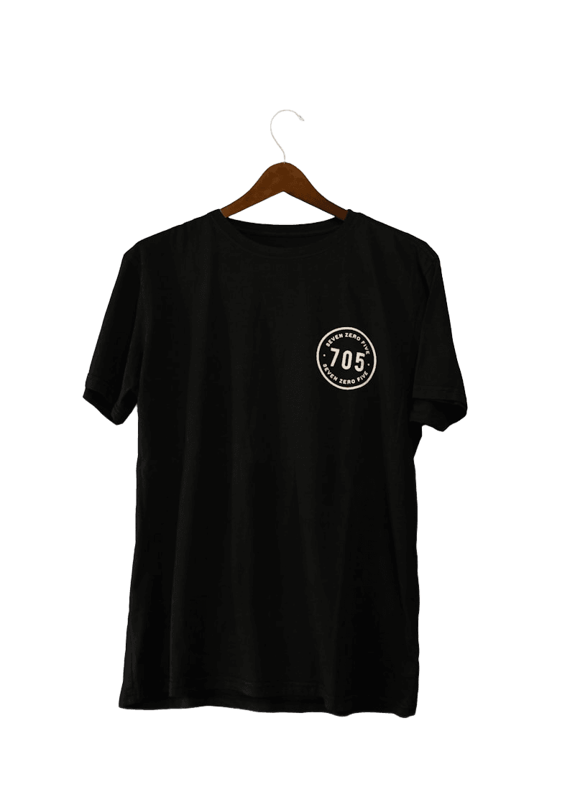
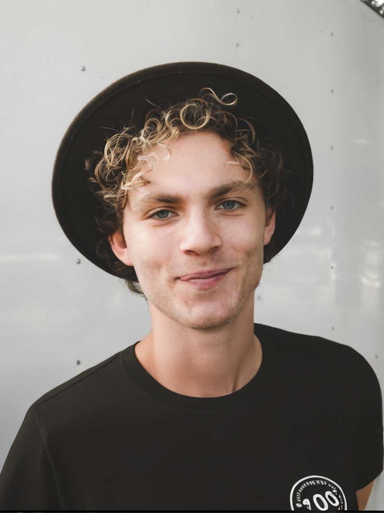
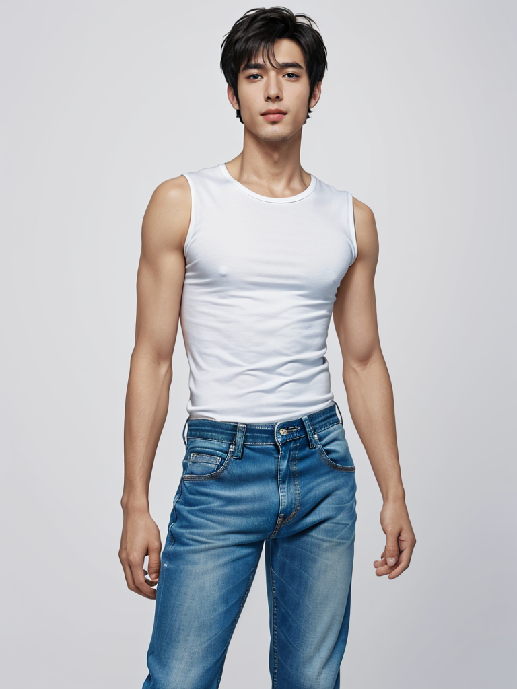
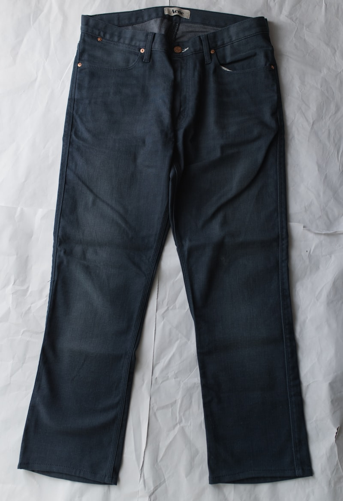
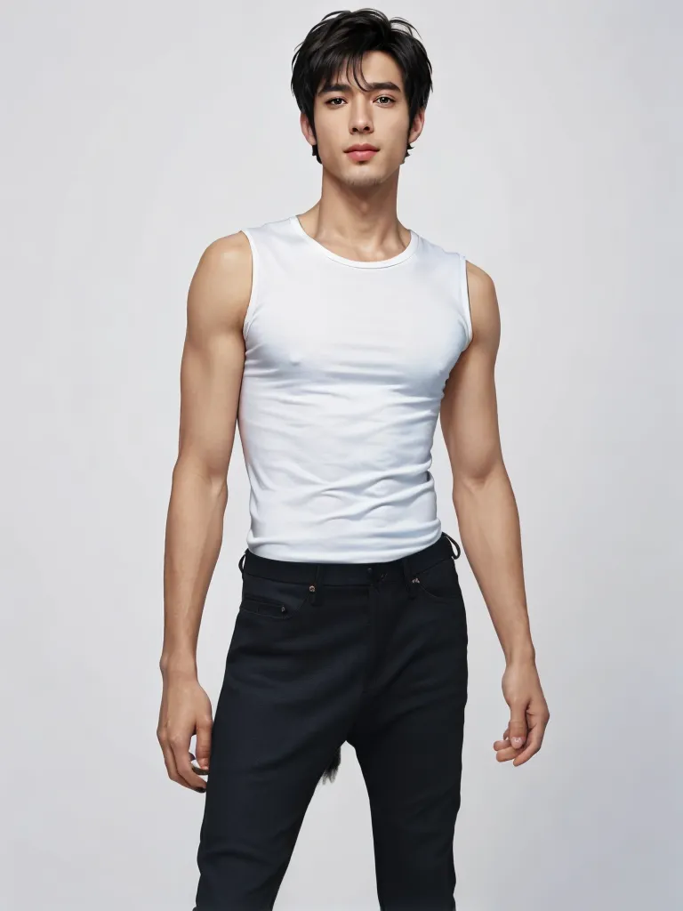

# vcloset — AI 가상 피팅 (앱)

내 사진과 옷 사진을 업로드하면 AI가 그 옷을 입은 모습을 합성해 보여주는 개인 가상 옷장 웹앱.
이 폴더(`app/`)는 실행 가능한 전체 코드(Next.js 16 풀스택 + Python 추론 브릿지)다.

> 프로젝트 전체 개요·문서는 상위 폴더의 [`../README.md`](../README.md) 참조.

## 문제 / 해결

- **문제** — 온라인 쇼핑에서 "이 옷이 나한테 어울릴까?"를 입어보기 전엔 알 수 없다.
- **해결** — 디퓨전 기반 Virtual Try-On(CatVTON / IDM-VTON)으로 내 사진 위에 옷을 합성한다.
  회원 옷장·크레딧·캐시·실패 자동환불까지 갖춘 서비스로 묶었다.

## 핵심 기능

- **회원 / 옷장** — NextAuth 인증, 프로필 사진 등록, 옷 업로드·갤러리(CRUD).
- **AI 피팅** — 상의·하의 가상 피팅. 합성에 약 20~50초.
- **룩북** — 합성 결과 모아보기.
- **크레딧** — 1회 합성 = 1 크레딧. 트랜잭션 + 원장(`CreditLedger`) 기록.
- **캐시** — 동일 (사람 + 옷) 조합은 이전 결과를 즉시 재사용(약 0.1초).
- **자동 환불** — 추론 실패 시 차감한 크레딧을 트랜잭션으로 되돌리고 REFUND 기록.

## 기술 스택

| 영역 | 스택 |
|------|------|
| 프론트 / 백 | Next.js 16 (App Router) · TypeScript · Tailwind v4 |
| 인증 | NextAuth v5 (Credentials) |
| 데이터 | Prisma · SQLite(로컬) → PostgreSQL(운영) |
| AI 추론 | CatVTON / IDM-VTON (사전학습) · rembg 배경 제거 |
| 추론 백엔드 | HF Space 브릿지(기본) · Colab · Modal · Replicate(선택) |

## 스크린샷

실합성 결과 (원본 → 옷 → 결과):

| 인물 | 옷 | 결과 |
|------|----|------|
|  |  |  |
|  |  |  |

라이브 화면: [`../docs/screenshots/vcloset_live.png`](../docs/screenshots/vcloset_live.png)

## 설치 & 실행

```bash
cd app
cp .env.example .env             # AUTH_SECRET 채우기 (openssl rand -base64 32)
npm install
npx prisma migrate dev           # DB 초기화
npm run dev                      # → http://localhost:3000
```

데모 데이터가 필요하면:

```bash
npx tsx scripts/seed-demo.ts     # 데모 계정 + 인물·옷 시드
```

가입 → 무료 크레딧 5장 지급 → `/onboarding`(내 사진) → `/closet/upload`(옷 추가) → `/try-on`(합성).

### AI 합성 켜기 (선택)

`INFERENCE_URL`을 비워두면 **placeholder 모드**(옷 이미지를 그대로 반환)로 동작한다.
실제 합성은 추론 백엔드를 연결한다. 기본 경로는 무료 HF Space 브릿지다.

```bash
# 무료 — Hugging Face 공개 CatVTON Space 중계 브릿지
cd inference
export HF_TOKEN="<HF 토큰>"       # 사용량 한도 확보 (선택)
uv run uvicorn hf_space_bridge:app --port 8899
# → .env 의 INFERENCE_URL="http://localhost:8899"
```

| 모드 | 켜는 법 |
|------|---------|
| placeholder | `INFERENCE_URL` 비움 (기본) |
| HF Space / Colab | `INFERENCE_URL` 설정 (`hf_space_bridge.py` 또는 `colab/catvton_server.ipynb`) |
| Modal | `INFERENCE_URL` + `INFERENCE_MODE=modal` ([`inference/README.md`](inference/README.md)) |
| Replicate | `REPLICATE_API_TOKEN` 설정 (있으면 자동 우선) |

## 프로젝트 구조

```
app/
├── src/
│   ├── app/                Next.js App Router (페이지 + /api 라우트)
│   │   └── api/try-on/     합성 오케스트레이션 (크레딧·캐시·환불·백엔드 폴백)
│   ├── components/         UI 컴포넌트
│   └── lib/                auth · prisma · storage · rembg · replicate-vton
├── prisma/                 schema.prisma + migrations
├── scripts/                seed 스크립트
├── inference/              Python 추론 브릿지
│   ├── hf_space_bridge.py  CatVTON HF Space 중계 (기본 경로)
│   ├── modal_idm_vton.py   Modal 서버리스 IDM-VTON 배포 스크립트
│   └── engine_test_suite.py
├── colab/                  catvton_server.ipynb (Colab T4 추론)
└── docs/DEPLOY.md          배포 가이드
```

## 환경 변수 (`.env`)

```
DATABASE_URL="file:./dev.db"
AUTH_SECRET="..."        # openssl rand -base64 32
AUTH_URL="http://localhost:3000"
INFERENCE_URL=""         # 비우면 placeholder, 설정하면 추론 브릿지 호출
REPLICATE_API_TOKEN=""   # (선택) 설정 시 IDM-VTON(Replicate)으로 자동 전환
```

## 데이터 모델

`User`, `ProfileImage`, `Garment`, `TryOnSession`, `CreditLedger` — `prisma/schema.prisma` 참조.

## 한계

- 합성 **모델 자체는 사전학습 오픈소스**(CatVTON / IDM-VTON)를 활용한 것이며, 자체 학습한 모델이 아니다.
  직접 설계·구현한 것은 그 모델을 제품으로 만드는 **서비스 전체**(옷장·크레딧·캐시·실패 환불·멀티 백엔드 추상화·전처리)다.
- 신발·액세서리는 VTON 기술 범위 밖이라 미지원.
- 로컬 스토리지(`public/uploads/`)를 사용하며, 운영 전환 시 R2/S3로 이전이 필요하다.
